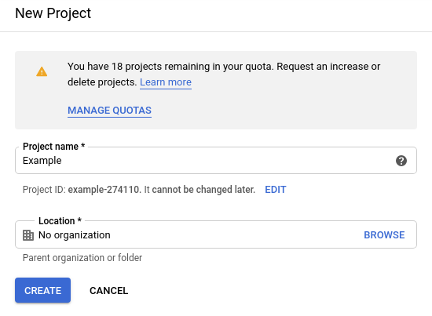
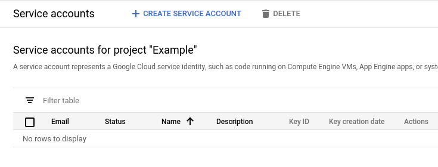
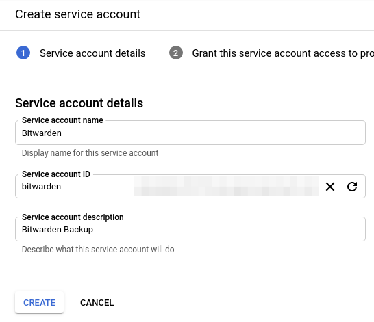
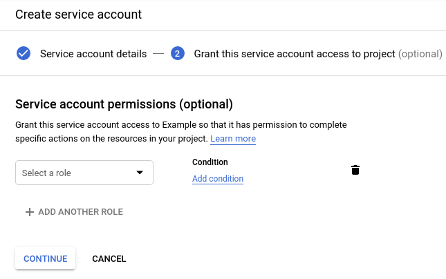

# Bitwarden

## Google API Service Account

1. Go to [Google Cloud Platform | Service Accounts](https://console.cloud.google.com/projectselector2/iam-admin/serviceaccounts?supportedpurview=project).
2. Create a new project e.g. Bitwarden

    

3. Create a service account

    
    
    
    
    

4. Create key (JSON), this is the key needed by the `upload.py` script
5. Share a `backup` folder from your Google Drive with the service account email address `bitwarden@example-xxx.iam.gserviceaccount.com`
